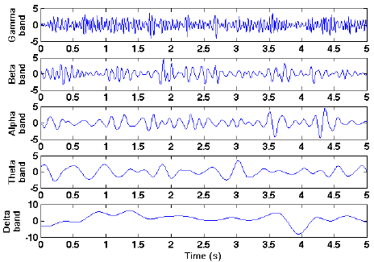
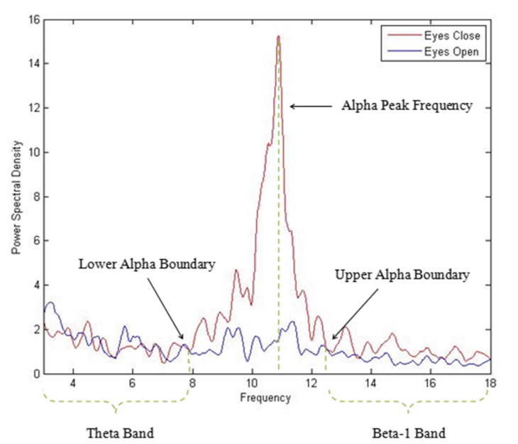
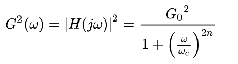

<h3>Introduction</h3>

Electroencephalogram (EEG) is a biosignal that represents the electrical activity generated by synchronized firing of cortical neurons. These signals are extremely low in amplitude (typically 10–100 μV) and sensitive to various types of contamination during acquisition. Physiological and non-physiological artifacts can distort the waveform, making clinical interpretation and automated processing more challenging.
Accurate filtering is therefore essential to preserve key EEG rhythms (delta, theta, alpha, beta, gamma) while suppressing noise introduced by the environment, the recording equipment, or the subject’s involuntary activities. In this experiment, common EEG artifacts are discussed and various filters are applied to enhance the signal quality for meaningful analysis of brain wave patterns.

<h3>Sources of Noise in EEG Signals</h3>

EEG signals are very small, so stronger physiological activities—such as muscle contractions and eye movements—often dominate the recording. The eyes act like large electrical dipoles and produce significant potentials during blinks and rapid horizontal movements (≈10 times per second). These artifacts appear across many electrodes but can be reduced using a nasal reference and differential amplification, which suppress common-mode signals.

The two main categories of artifact are physiological/biological/intrinsic artifact  and nonphysiological artifacts/ extrinsic artifacts, resulting from electrical phenomena or devices in the recording environment. Physiological artifacts may include cardiac, pulse, respiratory, sweat, glossokinetic, eye movement (blink, lateral rectus spikes from lateral eye movement), and muscle and movement artifacts. Examples of each type are explained below.
 

<b>Electrode motion </b>is another major source of noise; when an electrode shifts, the electrochemical balance at the electrode–skin interface is disturbed, producing large slow drifts that require time to stabilize and mainly affect very low frequencies. EEG activity is also influenced by environmental conditions such as temperature, where body cooling can slow EEG rhythms, making controlled recording conditions essential. In addition, external interference from powerlines, <b>electrical equipment</b>, cable movement, and clinical apparatus can introduce narrowband noise and transient spikes in the signal. 

<b>The major artifacts affecting EEG recordings include eye movement and blink artifacts:</b> 
 

<h4>1. Intrinsic Artifacts</h4>

  Intrinsic artifacts on the other hand are associated with the subject's body and are commonly called physiological
  artifacts. Such artifacts are usually due to eye movement and eye-blinks, muscle movements, or heartbeat.

 

  <b>a) Ocular Artifacts:</b> 
  A major source of artifacts in EEG signals is the eye blinks and eye movements. Such artifacts are also known as
  Electrooculogram (EOG) noise or ocular artifacts. Due to the proximity of the eye to the brain and the high sensitivity
  of EEG electrodes, the ocular artifacts generated from the movement or blink of the eye can be recorded in a large area
  of the brain specifically in the frontal lobe of the brain. As seen in <b>Figure 1</b> the amplitude of ocular artifacts is
  generally many times higher than normal EEG.

 

  

 

  <b>Figure 1: Physiological artifacts in EEG. (a) Eye movement, (b) Eye blink, (c) Muscle tension</b>

 

  <b>b) Muscle Artifacts:</b> 
  Another major source of artifacts in EEG signals is from the muscle activities of the subject also known as
  Electromyogram (EMG) artifacts as shown in <b>Figure-1</b>. EMG artifacts occur due to the electrical activity induced by
  the contraction of muscles. It is hard to distinguish and remove these artifacts as they came from different groups of
  muscles and have a broader frequency distribution. EMG artifacts in EEG data can be caused due to movement of any muscle
  such as moving the jaw, swallowing, chewing, talking, sucking, sniffing, grimacing, frowning, or hiccupping, as well as
  tension in neck and shoulder muscles. The amplitude and waveform of the EMG artifact may depend on the magnitude of
  movement of the muscles. EMG artifacts exhibit a high-frequency signal that affects the beta and gamma bands.

 

  <b>c) Cardiac Artifacts (ECG):</b> 
  Heartbeat can also cause artifacts in EEG data known as Electrocardiogram (ECG) artifacts. The heart pumps the blood in
  the brain. Although the magnitude of ECG artifacts is quite low, the rhythmic distortion caused by it can best be found
  on earlobe electrodes Al and A2. The frequency of ECG artifacts is typically 1.2 Hz and has a similar waveform as that
  of EEG. Also, due to its small amplitude, it is hard to visualize it with the naked eye. This makes it hard to remove
  from the EEG data.

  

  

 

  <b>Figure-2: Physiological artifacts in EEG. a) eye movement, b) eye blink, c) muscle tension</b>

 

  <b>d) Perspiration and Respiration Artifacts:</b> 
  Artifacts can also occur in EEG data due to perspiration through Sweat glands. These glands may cause changes in an
  electrical baseline of the EEG electrodes. Similarly, respiration can also distort the EEG data due to the movement of
  the chest and head while inhaling and exhaling. These artifacts can cause low-frequency noise in delta and theta bands
  of EEG.

 

<h4>2. Extrinsic (Non-Physiological) Artifacts</h4>

 

  <b>a) Power-line interference (50/60 Hz):</b> 
  The source of the most significant noise is acquired from the power line introducing electromagnetic signals of 50 Hz.
  The strong signals of AC lines may disrupt the EEG data during the data transfer from the electrodes over the scalp to a
  recording system. Depending on the source of the problem, line noise corrupts the data of few or all of the electrodes.
  This line noise is much higher than the signals of interest; the typical value of the EEG without artifacts is from
  0−70 μV and the power line is from 10 mV to 1V. The IIR notch filters with a null (Notch) frequency of 50 Hz are
  necessarily used to ensure perfect rejection of this strong signal.

 

  <b>b) Electrode Pop and Impedance Mismatch:</b> 
  This artifact is characterized by temporary failures in the contact between EEG electrodes and the scalp by touching
  the sensor or by spontaneous changes in electrode-skin contact. Mostly high amplitude interference on the EEG signal is
  localized in a single channel. A sudden change in the electrical potential between the electrodes and scalp gives rise
  to pop.

  

  

 

  <b>Figure-3: electrodes pop artifacts</b>

 

  <b>c) Cable Movement Artifacts:</b> 
  Cable movement changes in the electromagnetic fields produce distortion in the recorded signal and the scalp sensor
  contact. Moreover, AC electrical and electromagnetic interference is caused due to insufficient or lack of wire
  shielding, the signal can be affected by surrounding electromagnetic fields like AC power sources and wires. Moreover,
  a high spike around to [50–60] Hz overlapping the EEG signal can appear.

<h4>Typical EEG Waveforms and Frequency Bands</h4>

 EEG signals differ based on electrode placement and brain activity. To interpret them, they are commonly divided into five frequency bands, The frequency of EEG signals range from 0.01 Hz to around 100 Hz  

<ul>
  <li><b>Delta (below 3 Hz):</b> Prominent during deep stages of sleep.</li>
  <li><b>Theta (3–8 Hz):</b> Associated with light sleep, drowsiness, and early stages of sleep.</li>
  <li><b>Alpha (8–13 Hz):</b> Observed when a person is relaxed with eyes closed, representing synchronized brain activity.</li>
  <li><b>Beta (13–30 Hz):</b> Linked to alertness, concentration, and active thinking, exhibiting desynchronized EEG patterns.</li>
  <li><b>Gamma (above 30 Hz up to ~100 Hz):</b> Associated with higher cognitive functions such as perception, memory processing, and consciousness, and characterized by fast, low-amplitude activity.</li>
</ul>
 
 

<table border="1" style="margin: 0 auto;">
  <tr>
    <th>Band Name</th>
    <th>Frequency (Hz)</th>
    <th>Interpretation</th>
  </tr>
  <tr>
    <td>Delta</td>
    <td>&lt; 4</td>
    <td>Deep sleep</td>
  </tr>
  <tr>
    <td>Theta</td>
    <td>4–8</td>
    <td>Relaxed state and meditation</td>
  </tr>
  <tr>
    <td>Alpha</td>
    <td>8–13</td>
    <td>Relaxed state of consciousness</td>
  </tr>
  <tr>
    <td>Beta</td>
    <td>13–30</td>
    <td>Active thinking</td>
  </tr>
</table>

 

  <b> Figure 4 :Basic brain waves with their frequency.</b>

 

  

 

  <b>    Figure-5: EEG waveform frequency band</b>

<section>
<h2>Frequency-Domain Representation of EEG Signals</h2>

      EEG signals can also be analyzed in the frequency domain using spectral analysis. The power spectral
      density (PSD) plot represents the distribution of signal power across different frequency bands.
      Figure 7 shows a typical PSD of EEG signals recorded from an awake resting subject under eyes-open
      and eyes-closed conditions. It can be observed that alpha band activity (8–13 Hz) is prominent during
      eyes-closed condition and gets suppressed when the eyes are opened. This demonstrates the dependence
      of EEG rhythms on physiological and mental states.

</section>

  

  

 

  <b>Figure-6: Power Spectral Density of EEG signals for eyes-open and eyes-closed conditions</b>

<h4><b>Filters Used in EEG Processing</b></h4>

  There are several techniques used to denoise EEG signals. Each method has its own significance, as effective filtering
  is essential for accurate analysis of brain activity and neurological states. Due to the low amplitude and susceptibility
  of EEG signals to various artifacts, appropriate filtering helps improve signal quality and enables reliable interpretation
  of brain rhythms. In this section, some prominent filters used for EEG noise removal are discussed.

  <b>1. High-Pass Filter</b> 
  A high-pass filter removes very low-frequency artifacts such as baseline drift caused by perspiration, electrode
  polarization, respiration, and slow head movements. In EEG processing, a typical cutoff frequency ranges from 0.1 to
  0.5 Hz, which stabilizes the baseline while preserving low-frequency brain rhythms such as delta and theta waves.

 

  <b>2. Low-Pass Filter</b> 
  A low-pass filter attenuates high-frequency noise originating from muscle activity (EMG), motion artifacts, and
  electronic interference. In EEG applications, common cutoff frequencies lie between 30 and 70 Hz, ensuring that
  physiologically meaningful brain rhythms such as alpha and beta waves are preserved while suppressing unwanted
  high-frequency components.

 

  <b>3. Notch Filter (Band-stop)</b> 
  A notch filter is used to eliminate narrow-band power-line interference at 50/60 Hz without affecting nearby EEG
  frequency components. This filter is particularly important in EEG recordings due to the very low amplitude of brain
  signals and the high susceptibility to electrical interference from surrounding equipment.

 

  <b>4. Band-Pass Filter</b> 
  A band-pass filter allows only a specific range of frequencies to pass while suppressing both low-frequency drift and
  high-frequency noise. In EEG processing, a band-pass filter with a typical passband of 0.5–30 Hz is commonly used to
  retain meaningful brain wave activity, such as delta (&lt;3 Hz), theta (3–8 Hz), alpha (8–13 Hz), and beta (13–30 Hz).
  This selective filtering enhances the signal-to-noise ratio and facilitates detailed spectral and cognitive analysis.

 

  

 

  <b>Figure-7: Four basic filter types (f = frequency, a = amplitude).</b>

<h4><b>Filter Design in EEG Processing</b></h4>

Filtering plays a central role in EEG preprocessing, where the objective is to preserve neurologically relevant brain rhythms—such as delta, theta, alpha, beta, and gamma—while suppressing physiological and non-physiological artifacts. Due to the low amplitude and wide frequency overlap of EEG signals with noise sources, careful filter design is essential for accurate interpretation of brain activity. Finite Impulse Response (FIR) and Infinite Impulse Response (IIR) filters are commonly employed in EEG signal processing because of their complementary advantages in stability, phase response, and computational efficiency. High-pass, low-pass, band-pass, and notch filters are designed with appropriate cutoff frequencies to eliminate baseline drift, muscle artifacts, and power-line interference commonly encountered in EEG recordings.
 

<b>Butterworth Filters (IIR)</b> 
A Butterworth filter is a type of signal processing filter characterized by a frequency response that is maximally flat over the passband region, meaning it does not introduce ripples within the passband and maintains a smooth amplitude response. This property makes it suitable for applications requiring minimal amplitude distortion within the desired frequency range. In EEG processing, Butterworth filters are preferred for their smooth passband characteristics, which help preserve brain rhythm amplitudes without introducing ripples that could distort spectral analysis.
 

The frequency response of an 𝑛n-th order Butterworth low-pass filter is expressed as

  

<b>Where:</b> 
G(ω) is the magnitude response (gain) 
ω is the angular frequency in radians per second 
ωc is the cutoff frequency 
𝑛 is the filter order (number of poles) 
G0 is the DC gain (gain at zero frequency) 
N = 1………………………1st order Butterworth filter 
N = 2…………………………………………2nd order Butterworth filter 
N = 3…………………………………………………………3rd order Butterworth filter 

Order means to improve the accuracy of the filter, if we require more accuracy we require more order (value of N is high).
  

Above Figure 7 shows the magnitude response of Butterworth low-pass filters of orders 1 to 5, all having the same cutoff frequency at ω=1 rad/s where the gain falls to −3 dB. As the filter order increases, the passband remains maximally flat while the transition becomes steeper and the stopband roll-off improves from −20 dB/decade for 1st order to −100 dB/decade for 5th order, illustrating the 20n dB/decade slope characteristic of Butterworth filters.

  

 

  <b>Figure 8:gain of Butterworth low-pass filters of orders 1 through 5</b>

<h4><b>EEG-Specific Butterworth Filter Specifications</b></h4>

For EEG signal filtering, Butterworth filters are commonly implemented with the following configurations:

<ul>
  <li><b>High-pass Butterworth filter (0.1–0.5 Hz):</b> Removes slow baseline drift caused by perspiration, electrode polarization, and motion artifacts.</li>
   
  <li><b>Low-pass Butterworth filter (30–70 Hz):</b> Suppresses high-frequency noise originating from muscle activity (EMG) and electronic interference.</li>
   
  <li><b>Band-pass Butterworth filter:</b> Isolates specific EEG rhythms such as delta (0.5–4 Hz), theta (4–8 Hz), alpha (8–13 Hz), and beta (13–30 Hz) for detailed spectral and cognitive analysis.</li>
   
  <li><b>Notch Butterworth filter (50/60 Hz):</b> Eliminates narrowband power-line interference without significantly affecting adjacent EEG frequency components.</li>
</ul>
 

<h2>Window-Based FIR Filters</h2>

  The Finite Impulse Response (FIR) filter is a digital filter whose impulse response has a strictly finite duration.
  When an impulse is applied at the input, the output is non-zero only for a limited number of samples and then becomes
  exactly zero. Because FIR filters are realized without feedback and use only present and past input samples, they are
  inherently stable and structurally simple to implement. Their behavior is fully determined by a finite set of
  coefficients, which can be chosen to yield an exactly linear-phase response. This ensures that all frequency components
  of the input signal experience the same time delay and that waveform shapes are preserved.

  The windowing technique is one of the quickest and simplest methods for designing FIR filters. Filters designed using
  the windowing technique approximate ideal filters with some approximation error. Designing an ideal low-pass filter in
  the frequency domain with a cutoff frequency Fc and transforming it into the time domain results in a sinc function
  that extends infinitely in both directions. This leads to a very large number of taps, which is not practical, and
  therefore the impulse response must be truncated. To achieve this, the impulse response is multiplied by a window
  function, which truncates the infinite impulse response to a finite length required for FIR filter implementation.
  Different window functions are used for this purpose.

<b>Common windows include:</b>
<ul class="subpoint" style="margin-top: 0; margin-bottom: 0;">
  <li>Rectangular window</li>
  <li>Hamming window</li>
  <li>Hanning window</li>
  <li>Blackman window</li>
  <li>Kaiser window</li>
  <li>Bartlett window</li>
</ul>

 

<h2>Window Function Characteristics</h2>
<ul class="subpoint" style="margin-top: 0; margin-bottom: 0;">
  <li><b>Main-lobe width:</b> Controls the sharpness of the transition band between passband and stopband.</li>
  <li><b>Side-lobe level:</b> Determines how effectively the filter suppresses noise and reduces spectral leakage.</li>
  <li><b>Filter order (length):</b> Sets the trade-off between filter accuracy and computational complexity.</li>
</ul>

 
